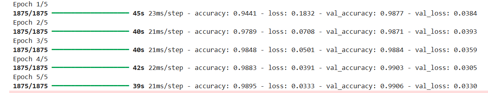
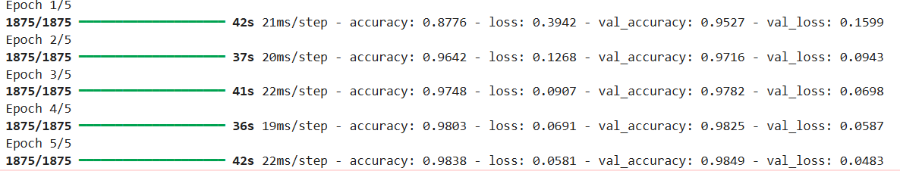

#### Installation des dépendances , les bibliotheques tensorflow numpy matplotlib pandas seaborn:
via l'instruction: 
**!pip install tensorflow numpy matplotlib pandas seaborn jupyter**
## Objectif
Notre projet compare deux architectures de réseaux de neurones pour la classification des chiffres manuscrits du dataset **MNIST** :
- Convolutional Neural Network **(CNN)**
- Long Short-Term Memory **(LSTM)**

## Étapes principales
1. Prétraitement des données (normalisation, reshape, one-hot encoding)
2. Entraînement de deux modèles distincts
3. Évaluation et comparaison sur le jeu de test
4. Visualisation des résultats (accuracy, loss, temps)

## 1)  Prétraitement des données MNIST

### Une fonction pour charger le dataset **MNIST** et effectuer le prétraitement.
- Transforme les labels (0 à 9) en vecteurs one-hot de taille 10
- CNN	(n, 28, 28, 1)	Image 2D + canal pour la convolution
- STM	(n, 28, 28)	Séquence de 28 lignes de 28 pixels

```python
def load_and_preprocess_data(for_lstm=False):
    (x_train, y_train), (x_test, y_test) = mnist.load_data()
    x_train, x_test = x_train / 255.0, x_test / 255.0  # normalisation
    
    if for_lstm:
        x_train = x_train.reshape(x_train.shape[0], 28, 28)
        x_test = x_test.reshape(x_test.shape[0], 28, 28)
    else:
        x_train = x_train.reshape(x_train.shape[0], 28, 28, 1)
        x_test = x_test.reshape(x_test.shape[0], 28, 28, 1)
   
    y_train = to_categorical(y_train, 10)
    y_test = to_categorical(y_test, 10)

    return (x_train, y_train), (x_test, y_test)
```
## Implémentation des deux architectures 
pour le code d'implémentation nous somme optés pour les properités suivantes:
- L’optimiseur contrôle la manière dont les poids du réseau sont ajustés à chaque itération pour réduire l’erreur.
- Adam = Adaptive Moment Estimation C’est un bon choix par défaut .
- metrics=['accuracy'] c'est la  métrique d’évaluation on veut suivre pendant l’entraînement.
 - accuracy (précision) = proportion de prédictions correctes.
 - Une epoch = le modèle a vu toutes les images une fois (en a pris 5).
## 2.1) Implémentation du CNN:
C'est un type de réseau de neurones artificiels spécialisé dans le traitement des images. Il est largement utilisé pour la reconnaissance visuelle (la classification d’images).Ce modèle apprend à reconnaître les chiffres manuscrits.Il atteint souvent >99 % d’accuracy sur **MNIST**.L’entraînement est rapide car les images sont petites (28×28).


```python
(x_train, y_train), (x_test, y_test) = load_and_preprocess_data(for_lstm=False)

cnn = Sequential([
    Conv2D(32, (3,3), activation='relu', input_shape=(28,28,1)),
    MaxPooling2D(2,2),
    Conv2D(64, (3,3), activation='relu'),
    Flatten(),
    Dense(128, activation='relu'),
    Dropout(0.5),
    Dense(10, activation='softmax')
])
model.compile(optimizer='adam', loss='categorical_crossentropy', metrics=['accuracy'])
history = model.fit(x_train, y_train, epochs=5, validation_data=(x_test, y_test))
start = time.time()
cnn.fit(x_train, y_train, epochs=5, validation_data=(x_test, y_test), verbose=0)
cnn_time = time.time() - start
cnn_acc = cnn.evaluate(x_test, y_test, verbose=0)[1]

```
## Tableau de CNN:


## 2.2) Implémentation du LSTM.
C’est un type particulier de Réseau de Neurones Récurrent (RNN).
C’est un modèle conçu pour traiter des données séquentielles, c’est-à-dire des données qui ont une dépendance dans le temps ou dans l’ordre (texte, audio, séries temporelles…). Il traite une séquence étape par étape, en gardant une mémoire interne (état caché).
```python
(x_train, y_train), (x_test, y_test) = load_and_preprocess_data(for_lstm=True)

model = Sequential([
    LSTM(128, input_shape=(28,28)),
    Dropout(0.5),
    Dense(10, activation='softmax')
])
model.compile(optimizer='adam', loss='categorical_crossentropy', metrics=['accuracy'])
history = model.fit(x_train, y_train, epochs=5, validation_data=(x_test, y_test))
start = time.time()
lstm.fit(x_train, y_train, epochs=5, validation_data=(x_test, y_test), verbose=0)
lstm_time = time.time() - start
lstm_acc = lstm.evaluate(x_test, y_test, verbose=0)[1]
```
## Tableau de LSTM:


## 3) Interprétation des résultats

 3.1. **Précision (Accuracy)**
Le **CNN** obtient une meilleure précision (99.19 %) que le LSTM (98.55 %).
Cela s’explique par la nature spatiale des images **MNIST** :
Le **CNN** exploite les corrélations locales entre pixels grâce aux filtres de convolution.
Le **LSTM**, conçu pour traiter des données séquentielles (textes, séries temporelles), n’est pas naturellement adapté aux images 2D.
Pour le **LSTM**, chaque ligne ou pixel est traité comme une séquence, donc il perd de l’information spatiale importante.


3.2. **Temps d’entraînement**
 
Le **LSTM** est plus lent (207 s) que le **CNN** (184 s).
Les **LSTM** traitent les données séquentiellement, donc ils ne peuvent pas paralléliser aussi efficacement que les convolutions.
Le **CNN** utilise des opérations matricielles hautement optimisées.


## Discussion 

Sur le dataset **MNIST**, le modèle **CNN** surpasse le modèle **LSTM** à la fois en précision et en efficacité temporelle. Cela s’explique par la nature des images : les **CNN** sont spécialement conçus pour capturer les dépendances spatiales locales grâce aux couches de convolution, tandis que les **LSTM** sont destinés à modéliser des séquences temporelles. Ainsi, bien que le LSTM puisse atteindre une précision correcte, il est moins efficace pour ce type de données et demande un temps d’entraînement plus long.
En perspective, le **LSTM** pourrait être plus intéressant sur des données séquentielles (par ex. reconnaissance de gestes, séries temporelles d’images ou texte manuscrit continu), tandis que le **CNN** reste la référence pour la classification d’images fixes comme **MNIST**.
